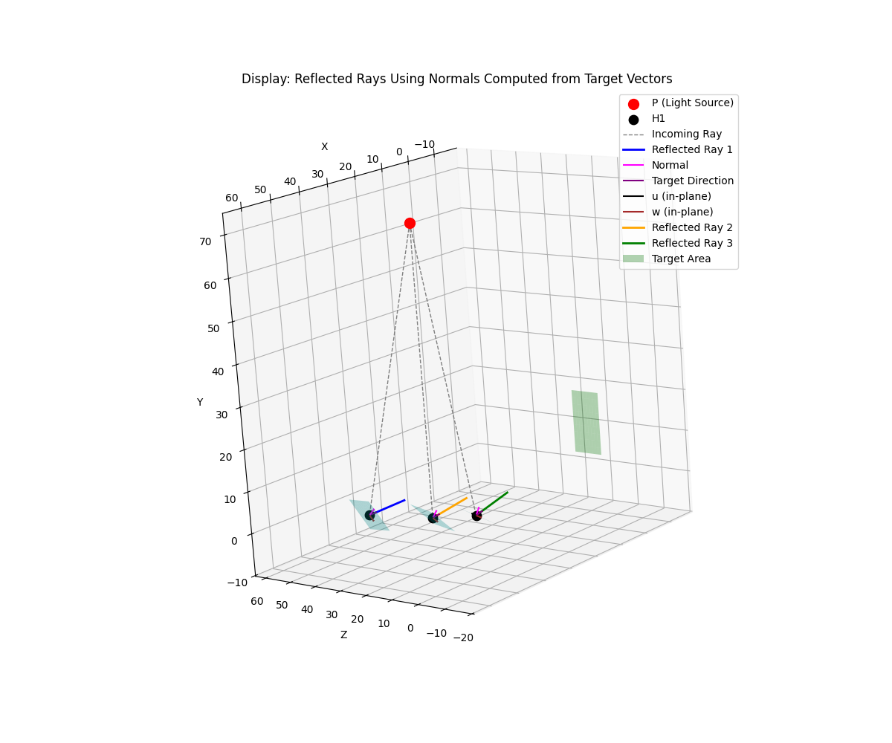
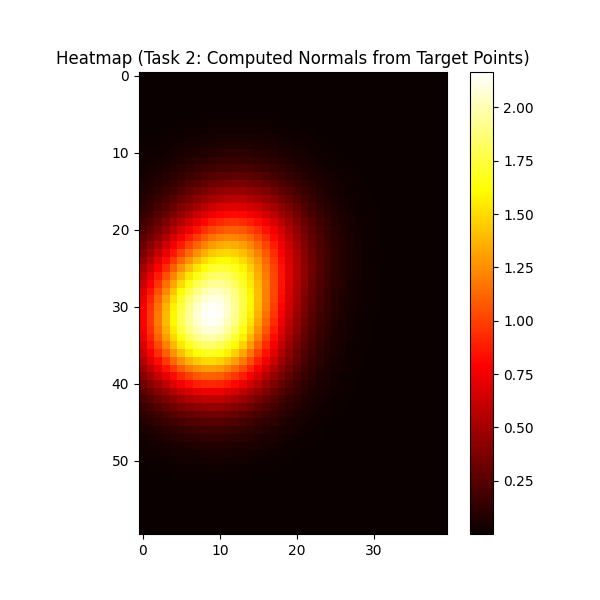

<p align="center">

</p>

# DOODLE (Not an acronym): Differentiable Heliostat Environment

This project implements a fully differentiable Gym environment for heliostat control. It provides a simplified, extremely fast “ray-tracer” that approximates a small fraction of what [ARTIST](https://github.com/ARTIST-Association/ARTIST) does—though it does it worse. However, it can be used to train policies using differentiable reinforcement learning, which can then be fine-tuned on ARTIST for more realistic performance.

## Key Characteristics

- **Differentiable:** All operations are implemented in PyTorch, allowing gradients to flow through the simulation for gradient‐based optimization and reinforcement learning.
- **Extremely Fast:** Designed for speed by tracing a single ray and using a single normal per heliostat.
- **Simplified Approximation:**  
  - Does not account for the distance from the receiver.
  - Ignores the ray angles and other realistic physical factors.
  - Provides only an approximation of flux predictions.
- **Policy Pretraining:** The environment can be used to train policies via differentiable RL; these policies can later be fine-tuned on ARTIST to improve realism.
- **Control Methods:**  
  - **Aim Point Update:** Actions directly shift the target coordinates (aim points).
  - **Motor Position Update ("m_pos"):** Actions represent angular rotations applied to the reflector normals.

## Features

- **Differentiable Simulation:** End-to-end differentiability enables integration with modern RL and optimization algorithms.
- **Target Area Rendering:** Heatmaps are generated using Gaussian blobs based on computed target positions.
- **3D Visualization:** A `display` function visualizes heliostat positions, reflection rays, and the target area surface in 3D.
- **Gym Environment Interface:** Compliant with the OpenAI Gym API for `reset`, `step`, and `render`.

## Requirements

- Python 3.7+
- [PyTorch](https://pytorch.org/)
- [Gym](https://github.com/openai/gym)
- NumPy
- Matplotlib

Install dependencies via pip:

```bash
pip install torch gym numpy matplotlib
```

## Project Structure

- **`env.py`**  
  Contains the `DifferentiableHeliostatEnv` class implementing the Gym environment.
  
- **`utils.py`**  
  Provides helper functions such as:
  - `reflect_ray`
  - `calculate_normals`
  - `calculate_target_coordinates`
  - `display` for 3D visualization
  
- **`target_area.py`**  
  Contains the `TargetArea` class for target area coordinate conversions and rendering.
  - `global_to_gaussian_blobs` (implemented as a method in the `TargetArea` class)

## Usage

### Running the Environment

A main function is provided in `main.py` to test the environment. It will:
1. Randomly sample a sun (light source) position and heliostat positions.
2. Initialize a target area with a specified center, height, and width.
3. For each control method:
   - **Aim Point Update:** Randomly shifts target points, computes normals and reflection directions, renders a heatmap, and displays the 3D scene.
   - **Motor Position Update ("m_pos"):** Applies angular rotations to the reflector normals, updates reflection directions, and renders a heatmap.
4. Render the corresponding heatmaps and 3D visualizations with the target area surface overlay.
    **Field Visualization**
    <p align="center">
    
    </p>

    **Predicted Flux Heatmap**
    <p align="center">
    
    </p>

To run the example:

```bash
python main.py
```

### Integrating with Reinforcement Learning

The environment follows the Gym API. For example:

```python
import torch
from differentiable_heliostat_env import DifferentiableHeliostatEnv

device = torch.device("cuda" if torch.cuda.is_available() else "cpu")
env = DifferentiableHeliostatEnv(control_method="aim_point", device=device)

obs = env.reset()
done = False

while not done:
    action = env.action_space.sample()  # or your agent's action
    obs, reward, done, truncated, info = env.step(action)
    env.render()  # Visualize the 3D scene (optional)
```

## Limitations

- **Simplified Model:** This environment is a rough approximation of ARTIST. It traces one ray per heliostat with a single normal, ignoring the ray angles, distance effects, and other realistic physical factors.
- **Flux Predictions:** The simplified model does not capture the full complexity of flux predictions as in realistic heliostat control.

## Policy Pretraining and Fine-Tuning

Despite its simplifications, this environment is differentiable and extremely fast. It can be used to train policies using differentiable reinforcement learning. Once a policy is pre-trained in this environment, it can be fine-tuned on ARTIST for more accurate and realistic heliostat control.

## Acknowledgements

This project is inspired by ARTIST and the need for differentiable simulation environments in heliostat control, and has been made at the German Aerospace Center (DLR).


-----------
<div align="center">
  <a href="https://www.dlr.de/EN/Home/home_node.html"></a>

</div>
